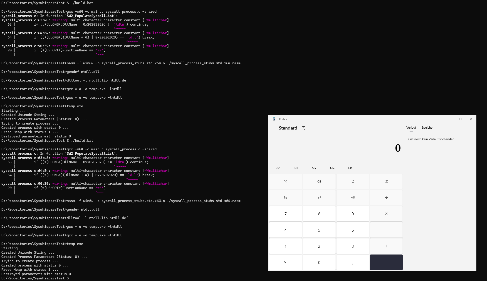

# References

https://captmeelo.com/redteam/maldev/2022/05/10/ntcreateuserprocess.html
https://www.reddit.com/r/ReverseEngineering/comments/umes97/poc_for_ntcreateuserprocess/
https://github.com/BlackOfWorld/NtCreateUserProcess/blob/main/main.cpp
https://joyasystems.com/list-of-ntstatus-codes
https://github.com/MicrosoftDocs/windows-driver-docs/blob/staging/windows-driver-docs-pr/kernel/using-ntstatus-values.md

https://github.com/rasta-mouse/ThreatCheck

# Changes to CaptMeelos PoC

1. use syswhispers2 duh
2. Allocate sizeof(PS_ATTRIBUTE_LIST) instead of only space for one attribute.
3. Set AttributeList->TotalLength = sizeof(PS_ATTRIBUTE_LIST); because of 2.
4. Use GetProcessHeap() instead of RtlProcessHeap (does eliminate the need for more definitions)
5. Add PS_ATTRIBUTE_PARENT_PROCESS to Attribtue List
6. Give 0 instead of NULL because Function Prototype of syswhispers2 seems two be slightly wrong (does not change anything within assembly)

